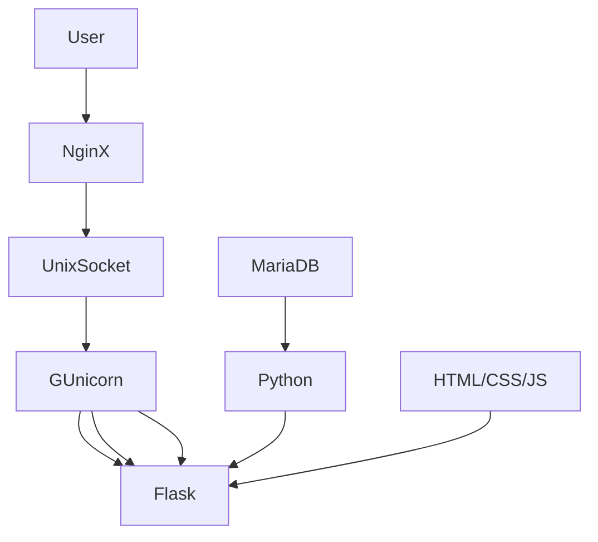
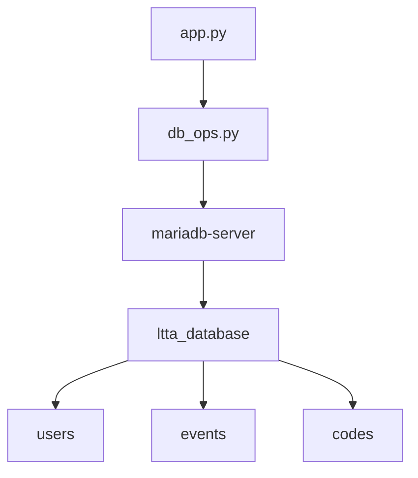

# Documentation for LTTA (Lyceum Table Tennis Application)

## Project Components


## Project Tree
- ltta.py (main file for flask app)
- db_ops.py (file for operations with database (to be clear with mariadb))
- utils/logger.py (helpful file to log data)
- wsgi.py (to deal with NginX through gunicorn)


- requirements.txt (python dependences are located there)


- docs.md

Also while prod there must be *venv, ltta.sock, logs.txt (or logs/logs.txt)* 

## MariaDB

Firstly, you need to create a database ltta:
```sql
CREATE DATABASE ltta;
```

I recommend to have a 'ltta'@'host' user in the MariaDB  
Use this shell command:  
```sql
CREATE USER 'ltta'@'localhost' IDENTIFIED BY 'strong_ltta_password';
GRANT ALL PRIVILEGES ON ltta.* TO 'ltta'@'localhost' IDENTIFIED BY 'ltta';
```
If you already have a user you want to operate with mariadb you can change his password by:
```sql
SET PASSWORD FOR 'ltta'@'localhost' = PASSWORD('strong_ltta_password');
```



### Users

Table users is:
username | name | surname | email | password | rating | role | grade | faculty | avatar |
---------|-------|-------|-------|----------|--------|------|-------|---------|--------|
TEXT  | TEXT | TEXT |VARCHAR(50)| TEXT     | FLOAT  |VARCHAR(20)|TINYINT|VARCHAR(50)| BLOB |
glebocrew | Глеб | Гриценко | glebocrew@yandex.ru | 0srut908530823804hew (sha256) | 0 | admin (or editor/user) | 10 | МатИнфо | 1B 20 1A ... (binary image) |

To create this table use:
```sql
CREATE TABLE users (username TEXT, name TEXT, surname TEXT, email VARCHAR(50), password TEXT, rating FLOAT, role VARCHAR(20), grade TINYINT, faculty VARCHAR(50), avatar BLOB);
```

When the user has just registered we need to add him to this table

```sql
INSERT INTO users (username, name, surname, email, password, rating, role, grade, faculty, avatar) VALUES ("username", "Глеб", "Гриценко", "email@example.com", "sha256ijfgdogsodfij", 0, "user", 10, "МатИнфо", "10 1A 1B 52...");
```

### Events
Table event is:
title | datetime | content | image | participants(usernames) |
------|----------|---------|-------|-------------------------|
TEXT  |  TEXT    | TEXT    | BLOB  |    TEXT                 |
Событие 1 | 2025-08-14 19:03:50.116672 | Очень интересное событие от Грандмастера | 0A 10 3A 52 | glebocrew,vladicrew |

To create this table use:
```sql
CREATE TABLE events (title TEXT, datetime TEXT, content TEXT, image BLOB, participants TEXT);
```

To insert new event:
```sql
INSERT INTO events (title, datetime, content, image, participants) VALUES ("Заголовок События", "2025-08-14 19:03:50.116672", "Это очень интересное событие где будет Грандмастер Старший и Младший", "52 1A 2B 4A ...", "");
```

### Codes 
email | code | datetime | name | surname | grade | faculty | username
------|------|----------|------|---------|-------|---------|---------
VARCHAR(50) | TEXT | TEXT | TEXT | TEXT  | TINYINT | VARCHAR(50) | TEXT
glebocrew@yandex.ru | 123456 | 19:03:50.116672 | Глеб | Гриценко | 10 | МатИнфо | glebocrew

To be clear.
Datetime -- is the exact time when the verification code was given.

To create table:
```sql
CREATE TABLE codes (email VARCHAR(50), code TEXT, datetime TEXT, name TEXT, surname TEXT, grade TINYINT, faculty VARCHAR(50), username TEXT, password TEXT);
```

To insert a code:
```sql
INSERT INTO codes (email, code, datetime, name, surname, grade, faculty, username, password) VALUES ("glebocrew@yandex.ru", "123456", "19:03:50.116672", "Глеб", "Гриценко", 10, "МатИнфо", "glebocrew", "123");
```